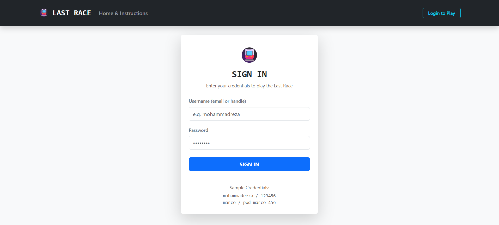
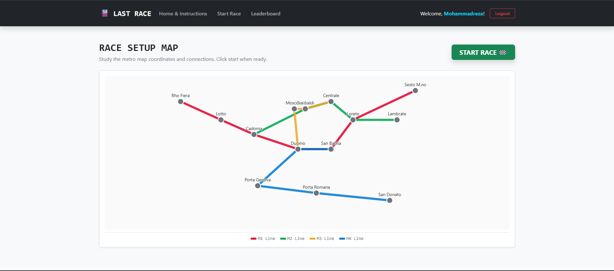

# Exam 1: "Last Race"
## Student: M. Mousazadeh

"Last Race" is a desktop-only single-player path-building game on the Milan metro network. Players are tasked with building a path between a start and destination station under a 90-second countdown timer. Each connection traversed triggers random events altering coin totals, and global rankings are recorded for all registered users.

---

## React Client Application Routes

- **Route `/`**: Public home page. Contains instructions, constraints, and dynamically routes to `/login` (for guests) or `/play` (for authenticated players).
- **Route `/login`**: Public credentials submission page. Validates username and password before authenticating. Redirects to `/` if session is active.
- **Route `/play`**: Private game page. Coordinates Setup (full map), Planning (alphabetical list + countdown timer), Execution (interval event updates), and Result (final score HUD).
- **Route `/ranking`**: Private leaderboard. Displays player usernames, display names, and high scores, highlighting the current user's entry.
- **Route `*`**: Fallback 404 handler for invalid transit URLs.

---

## API Server

### Authentication

- **POST `/api/sessions`**
  - Exchanges user credentials for a login session.
  - Request body: `{ "username": "mohammadreza", "password": "123456" }`
  - Response body: `{ "id": 1, "username": "mohammadreza", "name": "Mohammadreza" }`
- **GET `/api/sessions/current`**
  - Restores active user profile info from the current session.
  - Response body: `{ "id": 1, "username": "mohammadreza", "name": "Mohammadreza" }` or `401 Unauthorized`
- **DELETE `/api/sessions/current`**
  - Clears the session cookie and logs out the user.
  - Response: `204 No Content` or `401 Unauthorized`

### Game Flow

- **GET `/api/network`**
  - Retrieves the full metro system map data (used for the Setup view).
  - Response body:
    ```json
    {
      "stations": [{ "id": 1, "name": "Duomo", "x": 430, "y": 280 }, ...],
      "lines": [{ "id": 1, "name": "M1", "color": "#e4002b", "stationIds": [13,7,2,1,8,3,12] }, ...]
    }
    ```
- **POST `/api/games`**
  - Generates a new game instance. Chooses random start/dest stations >= 3 segments apart via BFS and records game state.
  - Response body:
    ```json
    {
      "gameId": 42,
      "start": { "id": 13, "name": "Rho Fiera" },
      "destination": { "id": 14, "name": "San Donato" },
      "stations": [{ "id": 1, "name": "Duomo", ... }, ...],
      "segments": [{ "id": "1-2", "a": { "id": 2, "name": "Cadorna" }, "b": { ... } }, ...],
      "durationSeconds": 90,
      "serverTime": 1730000000000
    }
    ```
- **POST `/api/games/:gameId/route`**
  - Validates and runs the submitted segment choices. Applies random effects on coins.
  - Request body: `{ "segments": ["3-2", "2-1"] }`
  - Response body:
    ```json
    {
      "valid": true,
      "steps": [
        { "from": { "id": 13, "name": "Rho Fiera" }, "to": { "id": 7, "name": "Lotto" }, "event": { "description": "Kind passenger gives you a coin", "effect": 1 }, "coins": 21 }, ...
      ],
      "finalScore": 17
    }
    ```
- **GET `/api/ranking`**
  - Returns leaderboard entries.
  - Response body:
    ```json
    [
      { "username": "mohammadreza", "name": "Mohammadreza", "bestScore": 23 },
      { "username": "marco", "name": "Marco", "bestScore": 15 }
    ]
    ```

---

## Database Tables

- **Table `users`**: Holds profile parameters. Columns: `id` (PK), `username` (UNIQUE), `name`, `salt`, and `hash`.
- **Table `stations`**: Coordinates and names. Columns: `id` (PK), `name` (UNIQUE), `x`, and `y`.
- **Table `lines`**: Metro lines. Columns: `id` (PK), `name` (UNIQUE), and `color`.
- **Table `line_stations`**: Line memberships. Columns: `line_id` (FK), `station_id` (FK), and `position` (order on line).
- **Table `events`**: Journey events. Columns: `id` (PK), `description`, and `effect` (modifier -4...+4).
- **Table `games`**: Game logs. Columns: `id` (PK), `user_id` (FK), `start_station_id` (FK), `dest_station_id` (FK), `status` ('planning'|'completed'|'invalid'), `score` (nullable), and `created_at` (ISO timestamp).

---

## Main React Components

- **`NavHeader`** (in `components/NavHeader.jsx`): Application header layout containing branding links, route triggers, session greetings, and logout actions.
- **`NetworkMap`** (in `components/NetworkMap.jsx`): Pure SVG rendering component mapping out station nodes, colored route paths (in Setup mode), start/dest rings, and dashed segments selection lines.
- **`SegmentList`** (in `components/SegmentList.jsx`): Alphabetical panel of network connections allowing players to add segments to their active route.
- **`RoutePanel`** (in `components/RoutePanel.jsx`): Route construction dashboard showing user chains, connection indicators (valid/invalid gaps), undos, clears, and submit events.
- **`Countdown`** (in `components/Countdown.jsx`): Countdown progress bar HUD transforming colors under time pressure (orange <30s, pulsing red <10s).
- **`LoginPage`** (in `pages/LoginPage.jsx`): Login UI panel prompting user credentials, handling error toasts, and routing sessions.
- **`GamePage`** (in `pages/GamePage.jsx`): Core layout orchestrator containing the state machine, API hookups, and execution interval animations.
- **`RankingPage`** (in `pages/RankingPage.jsx`): Table ranking layout sorting user scores and highlighting the logged-in user session row.
- **`AuthContext`** (in `contexts/AuthContext.jsx`): React provider managing logins, logouts, session checkups, and user hooks.

---

## Screenshots

### Leaderboard Ranking
##### Main Page


##### Login Page


##### Planning Page


##### Start Game (Nothing Happened but the game just started)


##### Start Game (Select Correct Path)


##### Win Game (After submission of Correct Path [Score Calculation])


##### Final Score Calculation


##### Start Game (Select Wrong Path)


##### Lose Game (After submission of Wrong Path)


##### LeaderBoard (Ranking Page)

---

## Users Credentials

- **Mohammadreza**: `mohammadreza` / `123456` (already has completed games)
- **Marco**: `marco` / `pwd-marco-456` (already has completed games)
- **Giulia**: `giulia` / `pwd-giulia-789` (no games played yet)

---

## Use of AI Tools
Used AI (Mostly Gemeni and Claude) for planning the structure and best practices.
Utilized AI for debugging and Testing the app and check the final version codebase with AI tools.
Created Documentation, Seed file, DB structure by getting assist from AI tools.
Utilizing AI for potential desing and some custom css and better usage of Bootstrap components.